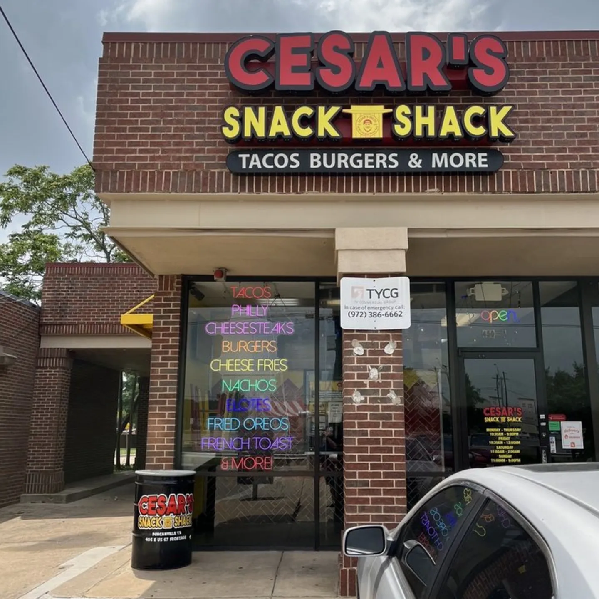

## _Howdy!_ 🤠
- 
- 🤠 Proudly born & raised in the Lonestar State. My Husband & I currently own a restaurant in the Dallas/Fort Worth area called 🌮 Cesar's Snack Shack 🍔. Our eagerness to see our restaurant expand by utilizing tools on social media is what inspired Me to return to school at ASU to pursue My B.S. in G.I.T.
- 🤓 I graduated with My A.S. from Dallas College in 2014, then attended Culinary School as I have always had a passion for cooking. 🧑‍🍳 Over the next few years I went on to build My career until finally having the opportunity to open a restaurant of My own with My Husband.
- 🍔 Cesar's Snack Shack opened it's doors in October 👻 of 2021. The Shack specializes in serving up a fusion of popular Mexican-American Snacks such as Agua de Mazapan, Birria Tacos, Cheesesteaks, Hot Cheetos Cheesesticks, & more!
- 😃 Eager to learn everything I can while pursuing My B.S. in G.I.T. so that it can be applied to helping build our restarant brand. We are super excited to be able to utilize these tools to build our website, design flyers, re-branding, & so much more!
- ⚡ Fun fact: We have two beautiful kiddos with one on the way, due this semester in Oct.!
